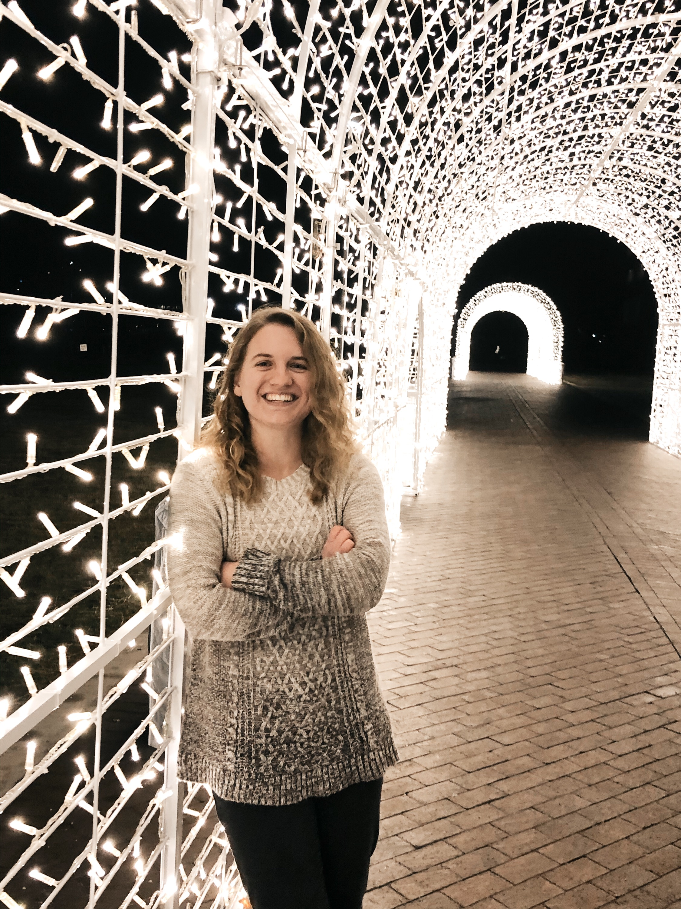

```{r setup, include=FALSE}
knitr::opts_chunk$set(echo = TRUE)
```

# Welcome

I am a graduate student at Bowling Green State University studying Applied Statistics. In May 2020, I earned a bachelor's degree in Mathematics and Actuarial Science from Grace College.

\

I have a passion for the intersection of math and sports, and hope to make a career in the sports world one day. My preferred sport is baseball, but college football, hockey, and golf are also pretty high on my list.

\

{width=50%,height=50%}

# Articles {.tabset .tabset-fade .tabset-pills}

This section will hold links to my Diamond Digest articles, as well as future articles for Softball America.

## Diamond Digest

I joined the staff of Diamond Digest in July 2020, primarily providing news and analysis related to the Miami Marlins. Below are a few examples of my work:  

\

[Pablo Lopez: The Breakout Arm No One Saw Coming](https://diamond-digest.com/2020/09/03/pablo-lopez-the-breakout-arm-no-one-saw-coming/)

[Offseason Outlook: Miami Marlins](https://diamond-digest.com/2020/11/17/offseason-outlook-miami-marlins/)

[NLDS Preview: Familiar Foe for the Fish](https://diamond-digest.com/2020/10/06/nlds-preview-familiar-foe-for-the-fish/)

[A Sigh of Relief for the Surprising Success of the Marlins Bullpen](https://diamond-digest.com/2021/05/26/a-sigh-of-relief-for-the-surprising-success-of-the-marlins-bullpen/)

[Miami Marlins Season Preview](https://diamond-digest.com/2021/03/21/miami-marlins-season-preview/)

\

## Softball America

[Oklahoma Alum Jadyn Wallis Has Built an NAIA Powerhouse](https://www.softballamerica.com/stories/oklahoma-alum-jadyn-wallis-has-built-an-naia-powerhouse/)

[Kent State's Brenna Brownfield Is Not Finished Yet](https://www.softballamerica.com/stories/kent-states-brenna-brownfield-is-not-finished-yet/)

[What It's Like to Transfer Halfway Through College](https://www.softballamerica.com/stories/what-its-like-to-transfer-halfway-through-college/)

\


# Projects

This section will hold links to past projects, most notably the Crossroads Baseball project.
